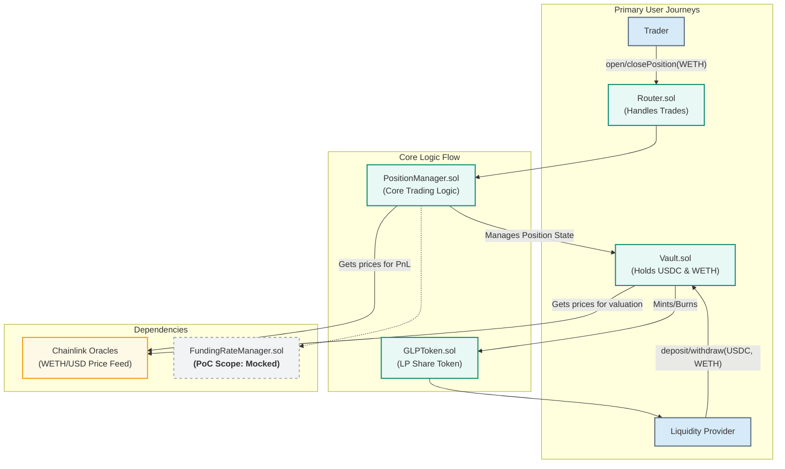

# GMF-Perpetual DEX - Proof of Concept

A decentralized perpetuals exchange based on a shared liquidity pool model, built as a Proof-of-Concept for a security bootcamp.

## Project Overview

This project is a simplified, yet functional, implementation of a perpetuals DEX. Unlike traditional order book or vAMM models, this protocol allows traders to open leveraged positions directly against a multi-asset liquidity pool (`GLP`). Liquidity Providers (LPs) act as the collective counterparty to all trades and earn fees from trading activity.

This Proof-of-Concept (PoC) focuses on implementing the core mechanics for a single trading pair (`WETH/USD`) with `USDC` as the primary collateral.

### Architecture (Minimum Viable Dynamics)

The system is designed with a modular, multi-contract architecture to ensure a clear separation of concerns.



### Key Architectural Decisions & PoC Simplifications

To achieve a functional prototype within a 4-day timeframe, the following strategic simplifications have been made:

  * **Single Trading Pair:** The vault is scoped to manage only `USDC` (collateral) and `WETH` (tradable asset).
  * **Mocked Funding Rate:** The `FundingRateManager.sol` contract is a placeholder. The complex logic for balancing open interest is out of scope for this PoC.
  * **No Keeper Network:** As the funding rate is mocked, no external keeper bot is required for this implementation.
  * **No Liquidations:** The system does not currently implement a liquidation engine. In a real-world scenario, this would make the protocol insolvent.
  * **Simple Fees:** A basic open/close fee is implemented to reward LPs, but more complex fee structures are not included.

## Getting Started

These instructions will get you a copy of the project up and running on your local machine for development and testing purposes.

### Prerequisites

  * [Git](https://git-scm.com/book/en/v2/Getting-Started-Installing-Git)
  * [Foundry](https://book.getfoundry.sh/getting-started/installation)

### Installation & Setup

1.  **Clone the repository:**

    ```sh
    git clone https://github.com/PhantomOz/gmf-perpetuals
    cd gmf-perpetuals
    ```

2.  **Install dependencies:**

    ```sh
    forge install
    ```

### Compiling

To compile all the smart contracts in the project, run:

```sh
forge build
```

### Testing

To run the full test suite:

```sh
forge test
```

For more detailed test output, use the verbose flag:

```sh
forge test -vvv
```

## Smart Contract Overview

| Contract                 | Description                                                                       | Status        |
| ------------------------ | --------------------------------------------------------------------------------- | ------------- |
| `Vault.sol`              | The central treasury. Holds all assets, manages liquidity, and mints/burns GLP.      | In Progress   |
| `GLPToken.sol`           | The ERC20 token representing a Liquidity Provider's share of the Vault.             | In Progress   |
| `Router.sol`             | The user-facing entry point for all trading operations.                           | Not Started   |
| `PositionManager.sol`    | The core logic engine for creating, managing, and calculating PnL for positions.  | Not Started   |
| `FundingRateManager.sol` | **Placeholder/Mock contract.** In a full system, this would balance open interest.     | Mocked        |

## Core Security Assumptions

This PoC operates under the following critical security assumptions. A full audit would need to rigorously validate these points.

1.  **Oracle Reliability:** The entire protocol's solvency is critically dependent on the integrity and availability of the Chainlink Price Feeds. A manipulated or stale price feed would lead to catastrophic failure.
2.  **Smart Contract Risk:** The code has not been audited. There may be vulnerabilities in the PnL calculation, asset handling, or access control that could lead to a loss of funds.
3.  **Economic Risk for LPs:** The design intentionally places Liquidity Providers as the counterparty to traders. LPs will incur losses if traders are, in aggregate, more profitable than the fees they generate. This is a core mechanic, not a flaw.

## Contributing

Please follow these simple guidelines for contributing to the PoC:

1.  Work on separate feature branches (e.g., `feat/vault-logic`, `test/position-manager`).
2.  Open a Pull Request (PR) to merge into the `main` branch.
3.  A PR requires at least one approval from another squad member before merging.
